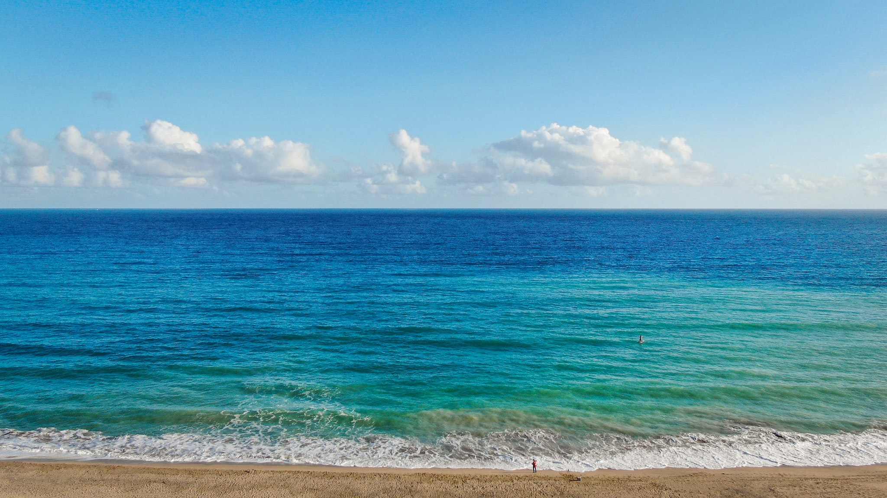

# MkDocs GLightbox

<p class="text-center" markdown>
[](https://pypi.org/project/mkdocs-glightbox)
[](https://pypi.org/project/mkdocs-glightbox)
[](https://codecov.io/gh/blueswen/mkdocs-glightbox)
</p>

A MkDocs plugin supports image lightbox with [GLightbox](https://github.com/biati-digital/glightbox).

GLightbox is a pure javascript lightbox library with mobile support.

## Dependency

1. GLightbox javascript file and css file
    1. GLightbox==3.2.0

## Usage

1. Install plugin from pypi

    ```bash
    pip install mkdocs-glightbox
    ```

2. Add ```glightbox``` plugin to your mkdocs.yml plugins sections:

    ```yaml
    plugins:
       - glightbox
    ```

3. All images will be added to the lightbox effect automatically, except images in an anchor tag and emoji images from [pymdown-extensions](https://facelessuser.github.io/pymdown-extensions/extensions/emoji/).

4. You may customize the plugin by passing options in mkdocs.yml:

    ```yaml
    plugins:
       - glightbox:
           touchNavigation: true
           loop: false
           effect: zoom
           slide_effect: slide
           width: 100%
           height: auto
           zoomable: true
           draggable: true
           skip_classes:
             - custom-skip-class-name
           auto_caption: false
           caption_position: bottom
           background: white
           shadow: true
           manual: false
    ```

    | Option | Default | Description |
    |---|---|---|
    | touchNavigation | true | Enable or disable the touch navigation (swipe). |
    | loop | false | Loop slides on end. |
    | effect | zoom | Name of the effect on lightbox open. (zoom, fade, none) |
    | slide_effect | slide | Name of the effect on lightbox slide. (slide, zoom, fade, none) |
    | width | auto | Width for inline elements and iframes. You can use any unit for example 90% or 100vw for full width. |
    | height | auto | Height for inline elements and iframes. You can use any unit for example 90%, 100vh or auto. |
    | zoomable | true | Enable or disable zoomable images. |
    | draggable | true | Enable or disable mouse drag to go prev and next slide. |
    | skip_classes | [ ] | Disable lightbox of those image with specific custom class name. |
    | auto_caption | false | Enable or disable using alt of image as caption title automatically. |
    | caption_position | bottom | Default captions position. (bottom, top, left, right) |
    | background | white | The background CSS of lightbox image. The background will shown when the image is transparent. You can use any CSS value for the background for example `#74b9ff` or `Gainsboro` or `none` for nothing. |
    | shadow | true | Enable or disable the shadow of lightbox image. Disable it when the background is `none` to prevent shadow around the transparent image. |
    | manual | false | When true, lightbox has to be enabled for each image manually by adding `on-glb` class to it or adding `glightbox: true` meta on page. |

    Check more options information on [GLightbox Docs](https://github.com/biati-digital/glightbox#lightbox-options).

5. For more flexibility:
      1. [Disable by image](./flexibility/disable-by-image.md): Disable the lightbox for specific images. Suitable for a few amount of images that don't need the lightbox effect.
      2. [Disable by page](./flexibility/disable-by-page.md): Disable the lightbox for specific pages. Suitable for a few amount of pages that don't need the lightbox effect.
      3. [Enable by image](./flexibility/disable-by-page-enable-by-image.md): Disable the lightbox for specific pages but enable some images on those pages. Suitable for a few amount of images that need the lightbox effect.
      4. [Disable globally but enable by image or page](./flexibility/enable-by-image-or-page.md): Disable the lightbox globally but enable specific images or specific pages. Suitable for a large number of images or pages that don't need the lightbox effect.
6.  Support lightbox image caption, check more details on [Caption](./caption/caption.md).
7.  Support grouping images as galleries, check more details on [Gallery](./gallery/gallery.md).

!!! note

    If this is your first time using the MkDocs plugin feature, you should know that MkDocs includes a default plugin named `search`. If you want to keep the search feature, you need to add the search plugin back to the `plugins` list.

## How it works

1. Copy GLightbox script file into `site/assets/javascripts/` directory and CSS file into `site/assets/stylesheets/` directory
2. Import GLightbox script and CSS file and add javascript code on each page excluded disabled pages
3. Search all image tags and warp with an anchor tag for GLightbox excluded images with skip class or already warped with an anchor tag

## Demo

Click the image to try lightbox and enjoy the view of Taiwan.

<figure markdown>

 

<figcaption markdown>Sunset over Taipei City. Credit: [Thomas Tucker](https://unsplash.com/photos/au3CYbd7vCU)</figcaption>
</figure>

<figure markdown>

 

<figcaption markdown>Lanyu, Taiwan. Credit: [Robson Hatsukami Morgan](https://unsplash.com/photos/T8LZZvKc9Jc)</figcaption>
</figure>

<figure markdown>

 

<figcaption markdown>Kenting, Taiwan. Credit: [Yuhan Chang](https://unsplash.com/photos/ROWXoqmqyjk)</figcaption>
</figure>


## License

This project is licensed under the MIT License - see the [LICENSE.md](https://github.com/Blueswen/mkdocs-glightbox/blob/main/LICENSE) file for details.
